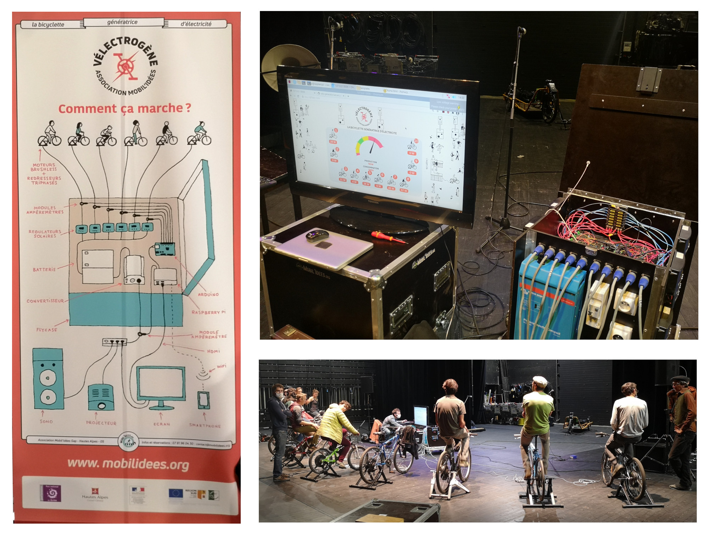

# Velo-generator

App to display electricity powered by bikes !

## Installation

Velo generator is a python3 / Flask web application

First install pip3 and virtualenv

`sudo apt-get install python3-pip`

`pip3 install virtualenv`

- Create a virtualenv

`virtualenv -p /usr/lib/python3 venv`

- Activate the virtualenv

`source venv/bin/activate`

- Install python dependencies

pip install -r requirements.txt

- Install node and npm

See https://github.com/nvm-sh/nvm#installing-and-updating

and then run :
`nvm install v14`

- Install frontend dependencies

From `static` folder run :
`npm install`

- Unsample the config file and fill it

`cp config.py.sample config.py`

In order to find USB ID run this command and find the ID of the two USB devices:
`lsusb`

## Run application

Virualenv must be activated

`python server.py`

The web application run on `127.0.0.1:5006`
